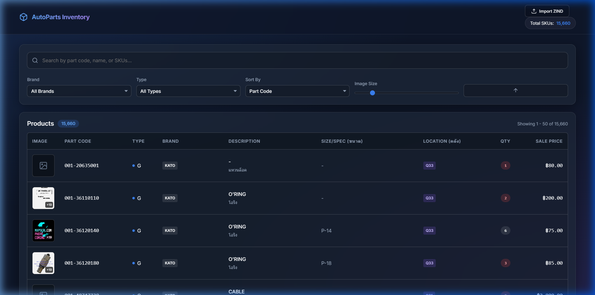
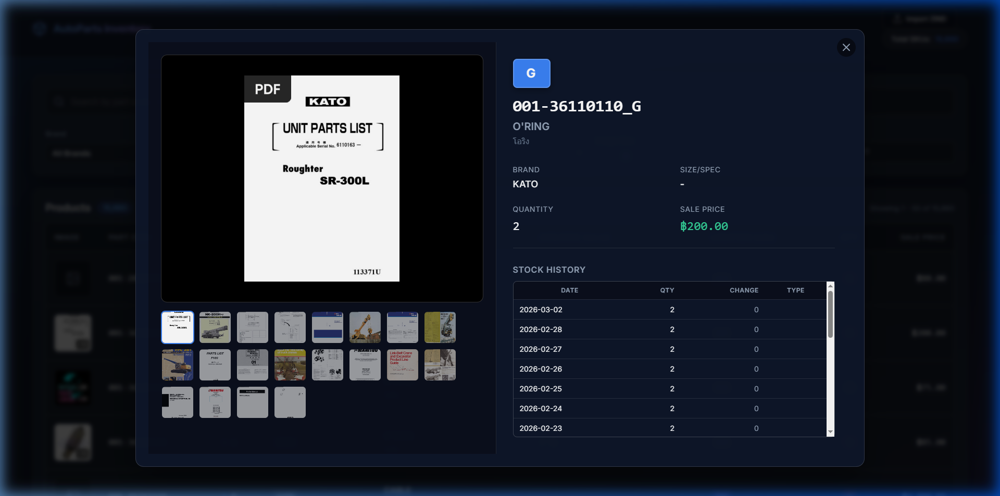

# AutoParts Inventory Application

This document provides a comprehensive overview of the custom web-based AutoParts Inventory Management System developed for your business. It explains how the system works under the hood and how to use its features.

## 🏗️ System Architecture

The application is built using a modern, lightweight, and local-first architecture:

- **Backend / API Wrapper**: Python 3 with the **Flask** framework. It serves the web pages and provides a REST API to query the database.
- **Database**: **SQLite** (`inventory.db`). A serverless, self-contained database engine that provides high-performance querying without needing a heavy database server like PostgreSQL.
- **Frontend**: Vanilla HTML5, CSS3, and JavaScript. No heavy frontend frameworks were used, keeping the application lightning-fast. It employs a modern "glassmorphism" dark-theme design.
- **Image Serving**: Images are served directly from your local hard drive (`C:\Users\Jan\Documents\CW\results_images\image\`).

---

## 💾 Data Pipeline & Database Schema

The core of the system relies on parsing your legacy `ZIND*.TXT` snapshots. 

### Processing Logic (`build_db.py`)
1. **Encoding**: The script safely decodes the ZIND files using Windows CP874 (Thai).
2. **Continuation Rows**: It handles products that span multiple rows in the text file, consolidating their quantities and location warehouse codes appropriately.
3. **Image Matching**: It finds the corresponding part image by looking in the local image directory. It automatically strips trailing `R` suffix codes from the part number when attempting to match the image folder. It selects the first alphabetical image as the primary thumbnail.
4. **Historical Snapshots**: The system reads all `.TXT` files in the `zind archive` folder. It extracts the date from the filename (converting from the Buddhist Era to the Gregorian calendar) and stores the quantities in a history log.

### Tables
The `inventory.db` SQLite database contains three main tables:

1. `products`: The main table holding the most recent snapshot data (SKU, Part Code, Name, Brand, Price, Size, Quantity, Locations, and Thumbnail Path).
2. `snapshots`: The history table tracking quantity and price changes over time per SKU per date.
3. `import_log`: A ledger of every ZIND file that has been successfully parsed to prevent duplicate imports.

---

## ✨ Application Features

### 1. The Main Dashboard (Product Grid)
- **Data Table**: Displays thumbnails, part codes, clear suffix type indicators (e.g., `G` for Genuine), English/Thai descriptions, Size/Spec, Warehouse Locations, Quantities, and Sale Prices.
- **Low Stock Alerts**: Quantities of 5 or lower are highlighted in red.
- **Pagination**: Handles the 15,000+ parts smoothly by paginating them server-side (50 per page).



### 2. Powerful Search & Filtering
- **Fuzzy Search**: A real-time search bar that filters across Part Codes, English Names, and Thai Names simultaneously.
- **Multi-parameter Filters**: Dropdowns to filter by Brand, Part Type Suffix, and Stock Activity (e.g., items moved in the last 7, 30, or 90 days).
- **Sorting**: Select standard sort keys (Part Code, Quantity, Price) and toggle ascending/descending order via the icon next to the dropdowns.
- **Adjustable Thumbnails**: A slider at the top allows users to instantly scale the size of the product images in the table from tiny 40px icons to massive 250px previews.

### 3. Product Details Modal
- **Quick View**: Clicking any product row instantly opens a modal overlay without leaving the page.
- **Full Image Gallery**: If a part has multiple images in its folder, an interactive thumbnail strip is generated allowing the user to click and view all angles.
- **Stock Movement History**: Displays a table showing the historical timeline of stock changes (calculated by comparing past daily ZIND snapshots). It calculates the mathematical difference and clearly labels movements as `In` (green) or `Out` (red).
- **Possible Titles & Multi-Color Keyword Highlighting**: Supplementary title data parsed from external CSV files is shown as tags. These undergo intelligent syntax highlighting: Engine references and models (bright yellow), Chassis types like "FD/FG/FB" (teal), and Forklift Brands (purple).
- **Stock Discrepancy Reporting**: A "Report Stock Mismatch" tool allows users to flag items directly from the modal if real-world stock differs from system stock.



### 4. Global Stock Moves Tracking
- **Dedicated Moves Tab**: A secondary view accessed via top tabs, exposing all stock additions (รับเข้า) and subtractions (จ่ายออก) across the entire inventory system over time.
- **Ledger-Accurate Data**: Pulls accurate, transaction-level data natively from the legacy `stock_ledger_full.csv` (instead of diffing slow static snapshots), displaying specific Document References, Transaction Categories, In/Out Quantities, and Running Balances.
- **Global Filtration**: Allows you to instantly search recent imports for newly arrived parts or view wide-scale sales activity, filterable by Move Type (In/Out) and searchable by part details.

### 5. Customer Activity Tab (ประวัติลูกค้า)
- **Customer History**: A dedicated view to look up the complete transaction history for any specific customer by their ID.
- **Ledger Integrated**: Uses the `stock_ledger_full.csv` archive to instantly query performance, showing the date, document ref, category, part code, description, and prices for every sale made to that user.

### 6. Issue Tracking Panel (รายการของไม่ตรงหน้าเครื่อง)
- **Discrepancy Review**: A dedicated dashboard tab combining all items that have been flagged as having inaccurate stock levels (either "more than", "less than" system, or "out of stock"). Admin users can review these flags to make cycle counts and manual corrections easier.

### 7. Automated Daily Imports & Master Data Refreshes
- **Refresh Ledger & Master Data**: Dedicated buttons in the header to instantly reload `product_master_active.csv` config and `stock_ledger_full.csv` history into system memory, complete with "Last Updated" timestamps showing the exact modification time of your data files.

---

## 🛠️ Operations & Maintenance

### Accessing the Application
On the computer hosting the server, open a web browser and go to:
`http://localhost:8081`

For anyone else in the office to access the Inventory System, they must be on the same WiFi/Network and type the host computer's IP address into their browser:
`http://192.168.1.127:8081`

### Running the Server
To start the application, open a terminal (PowerShell or Command Prompt) and run:
```bash
cd "D:\CW\inventory management system"
python server.py
```
*(Note: If the terminal ever prints a different IP address, provide that new IP to the employees.)*

### Rebuilding the Database from Scratch
If the database ever becomes corrupt or you wish to start completely fresh:
1. Stop the Flask server (`Ctrl+C` in the terminal).
2. Run the build script manually:
```bash
cd "D:\CW\inventory management system"
python build_db.py
```
This will delete `inventory.db`, scan all files in the `zind archive`, parse them, and rebuild the database from the ground up (this takes about ~20 seconds).
3. Restart the server (`python server.py`).

### Configuration (`config.ini`)
The application uses a `config.ini` file for configurable settings:
- **Logo path**: The company logo displayed in the header. Set as `logo_file` under `[paths]`.
- **Image directories**: Primary and secondary image directories with optional first-token folder matching.
- **Archived ledger directory**: Path to the folder containing `stock_ledger_full.csv`.

### On-Hand Quantity Data Source
The quantity displayed for each product is sourced from the **archived stock ledger CSV** (`stock_ledger_full.csv`), specifically the last `running_balance` recorded for each part. If a part is not found in the CSV, the system falls back to the ZIND snapshot-based quantity. The CSV is loaded into memory once at server startup; if the CSV content changes, a server restart is required to reflect the new data.

---

## 📝 Recent System Upgrades

### Full UI Localization (Thai)
- Translated core interactive UI elements, primarily replacing English table headers with Thai standard business terms (e.g., วันที่, เอกสาร, ประเภท, ราคา/หน่วย, รับเข้า, จ่ายออก, ยอดคงเหลือ).

### Buddhist Era (BE) Date Formatting 
- All standard Gregorian dates across tables and charts are dynamically parsed and formatted into the Thai Buddhist Era (`YYYY + 543`) on the frontend to match standard Thai accounting software expectations.

### Archived History (Old System)
- Product modals now include an **Archived History** section showing the full stock movement history from the legacy ERP system (parsed from `stock_ledger_full.csv`).
- Includes an interactive **Chart.js line graph** visualizing running balance over time.

### Massive Bug Sweep & Stability Fixes
- Addressed >10 critical syntax and logic bugs across the application frontend and backend.
- Fixed a broken route payload format (`/api/products/[sku]/flag`) that prevented users from submitting Stock Mismatch reports.
- Memory leak protections implemented via Python `try/finally` sqlite connection closures on backend endpoints.
- XSS (Cross Site Scripting) patches added to user-submitted flag notes rendering.
- Re-architected the Stock Moves tab to read accurately from the legacy ledger CSV data instead of querying fast but inaccurate ZIND snapshot differences.

